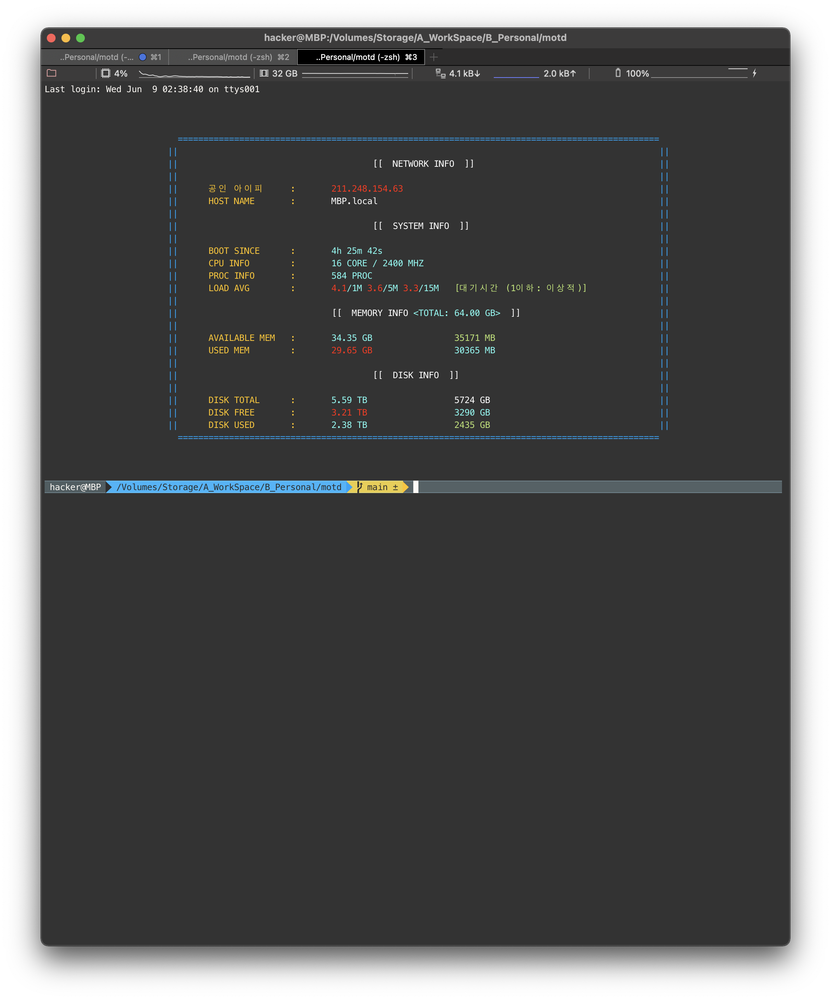

# RUST beautiful motd

## Requirements

- plz install 'RUST'
- JUST TYPE : `./bin/build_release.sh` 
- TYPE THIS !:
  - `sudo cp ./target/release/motd_kuuwange /etc/` 
  - `sudo chmod +x /etc/motd_kuuwange`
- If YOU USE ZSH :
  - `echo "/etc/motd_kuuwange" >> ~/.zshrc`
- IF YOU USE BASH:
  - `echo "/etc/motd_kuuwange" >> ~/.bashrc`
- DONE!, ENJOY~

